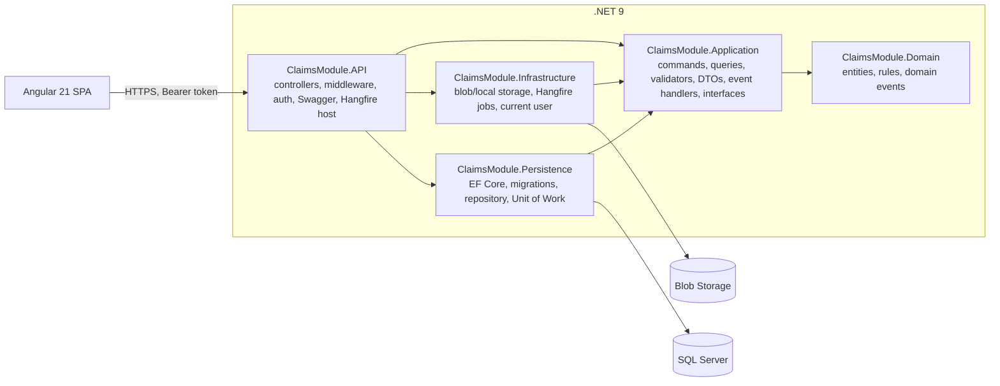
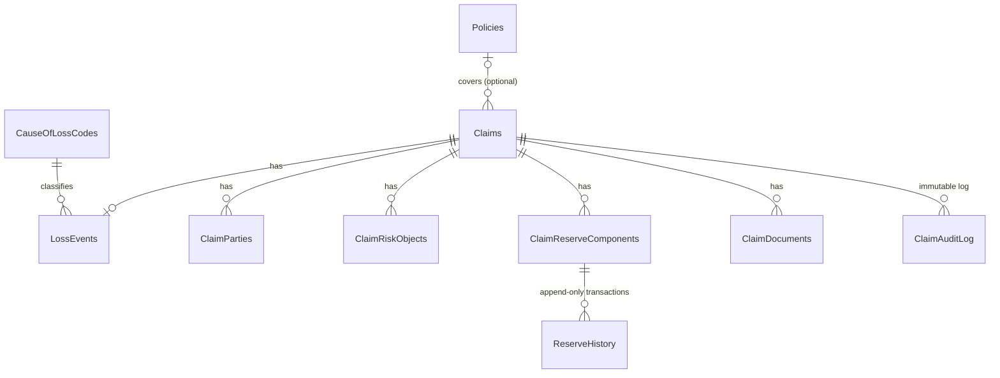
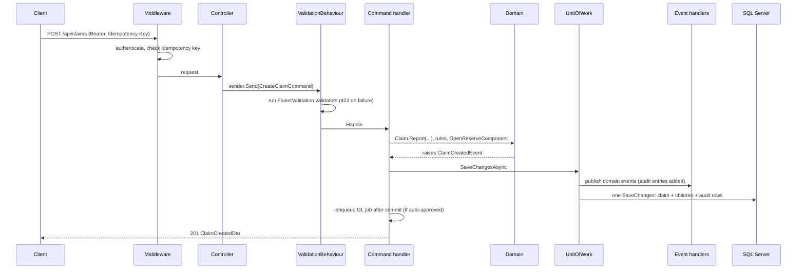
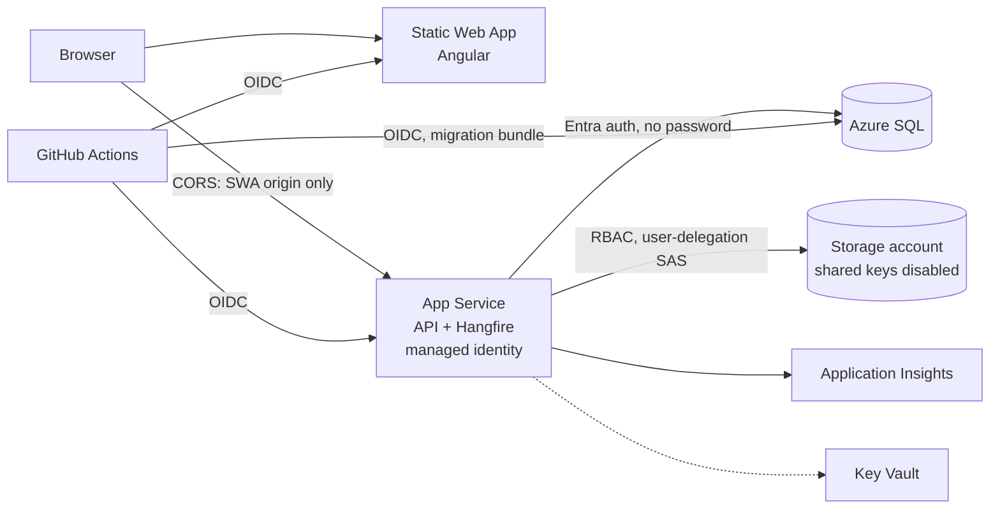

# Architecture

This document describes the system as built. The requirements it implements are extracted in [`docs/requirements.md`](docs/requirements.md) and [`docs/architecture.md`](docs/architecture.md); decisions that resolve conflicts between the FRS and the assessment brief are in [`docs/decisions.md`](docs/decisions.md).

## 1. Solution structure

Dependencies point inwards. **Domain** references nothing (no EF Core, no MediatR). **Application** defines the ports it needs (`IApplicationDbContext`, `IClaimRepository`, `IUnitOfWork`, `IStorageService`, `IGlPostingScheduler`, `IAuditLogService`, `ICurrentUserService`, `IIdempotencyStore`, …); **Infrastructure** and **Persistence** implement them; **API** composes everything and exposes HTTP.

| Project | Contents |
|---|---|
| Domain | `Claim` aggregate and its children, reference data (`Policy`, `CauseOfLossCode`), audit log entity, enums; rule classes `ClaimStatusTransitions`, `ClaimStatusChangePolicy`, `ClaimIntakeRules`, `ClaimSla`, `ReserveRules`, `ReserveAuthority`, `DocumentPolicy`; domain events; `SequentialGuid` |
| Application | one folder per use case (`Claims/Commands/CreateClaim`, `Reserves/Commands/ApproveReserve`, …) with command/query, handler and validator; `ValidationBehaviour`; domain-event notification handlers; `AuditLogService`; AutoMapper profile; projections |
| Infrastructure | `AzureBlobStorageService` / `LocalFileSystemStorageService`, `HangfireGlPostingScheduler`, jobs (`PostGLReserveChangeJob`, `SlaMonitoringJob`, `IdempotencyCleanupJob`), `CurrentUserService`, `CorrelationIdProvider` |
| Persistence | `ClaimsDbContext` (conventions, global filters, audit stamping), `IEntityTypeConfiguration` classes, migrations, `ClaimRepository`, `UnitOfWork` (transactions + domain-event dispatch), `ClaimNumberGenerator` (SQL sequence), `IdempotencyStore` |
| API | controllers, `ExceptionHandlingMiddleware`, `IdempotencyMiddleware`, `MockAuthenticationHandler`, Swagger configuration, Hangfire dashboard and recurring-job registration |

The Angular frontend is described in §9.

## 2. Data model

- **`Claim` is the aggregate root.** Parties, risk objects, reserve components, reserve history and documents are changed only through the claim (`Claim.OpenReserveComponent`, `ClaimReserveComponent.RecordTransaction`, `Claim.AddDocument`, `Claim.ChangeStatus`), and the claim is loaded with the children a use case needs (`GetWithReservesAsync`, `GetWithPartiesAsync`, …).
- **Reserves are event-sourced.** A reserve change never updates a row: every add, adjustment or reversal inserts a `ReserveHistory` row with `PreviousBalance`, `NewBalance`, `ChangeSequence` and approval/posting status; the component's balance is derived from approved rows (FRS §6.6, ADR-002).
- **Conventions (FRS §15)** are applied in one place — `AuditableEntityConfiguration` and `ClaimsDbContext`: `UNIQUEIDENTIFIER` keys with `NEWSEQUENTIALID()`, `DECIMAL(19,4)` money, `DATETIMEOFFSET(7)` timestamps, `CreatedAt/UpdatedAt/UserCreated/UserModified` stamped in `SaveChangesAsync`, `IsDeleted/DeletedAt` soft delete (a delete becomes an update), `OrganisationId` on every table, `RowVer` concurrency tokens on `Claims` and `ClaimReserveComponents`, enums stored as strings.
- **Global query filter** on every entity: `OrganisationId == current organisation` and, for soft-deletable entities, `!IsDeleted` (one expression, because EF Core 9 allows one filter per entity).
- **Claim activity.** A change to any claim child (`IClaimChild`) also bumps the parent claim's `UpdatedAt`, which is what the SLA job measures.
- **Claim numbers** come from the SQL sequence `ClaimNumberSequence` — atomic and gap-free under concurrency (FRS §5.3), unique per organisation.
- `IdempotencyRecords` is a technical table (audit and tenant columns, no soft delete; expired rows are deleted).

## 3. Request flow (CQRS)

Every state change is a MediatR command and every read a query; controllers only translate HTTP to a request and back.

- **Validation** runs in the MediatR pipeline (`ValidationBehaviour`), so it applies to every command and query regardless of caller — including Hangfire jobs. Input rules live in validators; business rules that need the aggregate live in the Domain and surface as the same 422 shape (`BusinessRuleViolation` → `ValidationException`).
- **Errors** are mapped once in `ExceptionHandlingMiddleware`: validation → `422` with `{ type, title, status, errors }` (FRS §10.4), not found → `404`, concurrency conflicts and unique-key races → `409`, anything else → `500` without internals.
- **Unit of Work** — `IUnitOfWork.SaveChangesAsync` dispatches domain events and then saves; `BeginTransactionAsync` wraps multi-step writes. Creating a claim with an initial reserve saves the claim first (to get its database-generated id), records the reserve, saves again, and commits both or rolls both back.
- **Reads** are projections straight from `IApplicationDbContext` with `AsNoTracking` (list, detail, audit log, reserves); writes load the aggregate through `IClaimRepository`.
- **Idempotency-Key** — `IdempotencyMiddleware` stores the first successful response of a write request per key and replays it for repeats (`Idempotency-Replayed: true`); a different request with the same key is a `422`, a request still in progress a `409` (`docs/api-contract.md` §5a). The frontend sends a key when creating claims and reserves.
- **Audit** — every significant action writes a `ClaimAuditLog` row through `IAuditLogService` in the same save as the change, with old/new values, the related entity and the request's correlation id.

## 4. Domain events

| Event | Raised by | Handled by | Effect |
|---|---|---|---|
| `ClaimCreatedEvent` | `Claim.Report` (FNOL) | `ClaimCreatedEventHandler` | `CLAIM_CREATED`, plus one `VALIDATION_ISSUE_ADDED` per intake warning from `ClaimIntakeRules` (policy unknown, loss date outside the policy period — BR-C-02, no risk objects) |
| `ClaimStatusChangedEvent` | `Claim.ChangeStatus` — one per transition (Reopen raises Closed→Reopened, then the automatic Reopened→Open) | `ClaimStatusChangedEventHandler` | `STATUS_CHANGED` with reason and acknowledged warnings, plus `CLAIM_CLOSED` / `CLAIM_REOPENED` |

Events are plain records collected on the entity (the Domain has no MediatR dependency). `UnitOfWork` wraps each in `DomainEventNotification<T>` and publishes it through MediatR **before** saving, so handlers' writes commit atomically with the change that raised them. GL posting is intentionally *not* an event handler: it is an external side effect that must happen only after commit.

## 5. Business rules

Rules sit in the Domain as small, pure, unit-tested classes and are reused by the command handlers:

| Rule class | Covers |
|---|---|
| `ClaimStatusTransitions` | the FRS §4.2 state machine as a table, with the roles permitted per transition (ADR-001) |
| `ClaimStatusChangePolicy` | blocking conditions per target status: critical issues and claimant before Open, closure conditions CC-01…CC-04, reasons for Withdrawn/Reopened, warning acknowledgement for Draft→Open |
| `ClaimIntakeRules` | intake warnings (policy unknown, loss date outside policy period, no risk objects) |
| `ReserveRules`, `ReserveAuthority` | amount rules, one open component per type, pending-change lock, $10,000 / $100,000 thresholds on the absolute amount, self-approval ban, $10M aggregate limit with manager override (ADR-003/004), retract and retry rules |
| `ClaimSla` | 48-hour inactivity breach, at most one breach entry per 24 hours |
| `DocumentPolicy` | allowed file types (extension and file signature), 50 MB limit, file-name sanitising |

Authorization is enforced server-side in these rules (the role comes from the token), not only by hiding buttons.

## 6. Background jobs (Hangfire)

Hangfire uses the application's SQL database. Jobs call MediatR commands, so the same validation, rules, audit and Unit of Work apply as for HTTP requests.

| Job | Trigger | Behaviour |
|---|---|---|
| `PostGLReserveChangeJob` | enqueued after a reserve is auto-approved or approved (always after the save that approved it), or when a user retries a failed posting | Writes the simulated journal (`DR Change in Outstanding Reserves / CR Outstanding Loss Reserves`) as `GL_POSTING_SIMULATED` and marks the transaction `Posted` in one save. |
| `SlaMonitoringJob` | recurring, every 15 minutes | Finds Draft/Open claims not updated for 48 hours and writes `SLA_BREACH_DETECTED` (at most once per 24 hours per claim). |
| `IdempotencyCleanupJob` | recurring, hourly | Deletes idempotency records older than 24 hours. |

**GL posting idempotency.** Each reserve transaction carries the key `Reserve:{ReserveComponentId}:Change:{ChangeSequence}` (BR-R-06). The job checks the transaction's state before any write: if it is already `Posted` it does nothing, and the audit entry and the `Posted` status are written in the same transaction — so a retry or a duplicate run can never produce a second journal entry. Hangfire retries a failing job automatically (10 attempts); after the last attempt the transaction becomes `Failed` with a `GL_POSTING_FAILED` audit entry. A user can then **retry** (`POST …/retry-posting`): the status returns to `Pending`, `GL_POSTING_RETRIED` is audited, and the job is enqueued again with the same key.

## 7. Document storage

`IStorageService` has two implementations, chosen by `Storage:Provider`:

- **Azure Blob Storage** (`claim-documents/{organisationId}/{claimId}/{documentId}-{name}`). In Azure the API authenticates with its managed identity and signs download links with a **user-delegation SAS** (read-only, one blob, 1-hour lifetime, inline with the original file name). Document bytes never pass back through the API (BR-D-02).
- **Local filesystem** fallback for development (BR-D-03), served under `/uploads`. Outside Development the API refuses to start without Azure storage rather than writing to App Service's ephemeral disk.

## 8. Security, tenancy and Azure

- **Authentication** is a mock bearer scheme (assessment §3.7.4): the token is base64 JSON `{ userId, role }`; roles `handler`, `supervisor`, `manager`. Every API endpoint except health requires it.
- **Tenancy** — a single configured `OrganisationId`, stamped on insert and enforced by the global query filter on every read.
- **No stored secrets** — SQL uses Entra-only authentication with the web app's managed identity, storage has shared-key access disabled, and CI/CD signs in with GitHub OIDC. Key Vault exists for future secrets but holds none.
- **Infrastructure as code** — all resources are Bicep templates in `iac/` (see `iac/README.md`), validated on every pull request and deployed by `iac-cd`.
- **Delivery** — `backend-cd` builds and tests, applies EF migrations with a migration bundle (opening a temporary SQL firewall rule for the runner), deploys the API and smoke-tests `/api/health` and Swagger; `frontend-cd` builds, tests and deploys to the Static Web App.

## 9. Frontend

- **Angular 21**, standalone components, **signals** for state (component-local `signal`/`computed` plus root services), `OnPush` everywhere, strictly typed **Reactive Forms**, Angular Material with a custom navy palette.
- **Lazy-loaded feature routes** — `claims-list`, `fnol`, `claim-detail` — each its own bundle.
- **Typed API layer** (`src/app/api`) is the only code that calls `HttpClient`; models mirror the backend DTOs.
- **Interceptors** — `authInterceptor` adds the mock bearer token for the selected user; `errorInterceptor` turns every API error into a snackbar (a request can opt out to show errors inline, e.g. the status-change dialog).
- **Business logic kept testable** — FNOL rules, reserve thresholds, closure checklist and URL-filter mapping are pure functions with unit tests; components bind to precomputed view models.
- Dashboard filters live in the URL; creating a claim or reserve sends an `Idempotency-Key`, so double submissions are harmless.

## 10. Key decisions and trade-offs

| Decision | Why | Trade-off |
|---|---|---|
| State machine as a Domain rule table, not a `ClaimStatusTransitions` database table (ADR-001) | the FRS rules include roles and conditions that a from/to table cannot express; one tested source of truth | changing transitions needs a deployment |
| Reserve adjustment is `PUT` externally but an insert internally (ADR-002) | satisfies the assessment's `PUT` and the FRS's append-only reserves | the `PUT` is not a replace |
| $10M limit and override on the claim (ADR-003); no per-role submission cap (ADR-004) | the limit is aggregate per claim; the FRS defines thresholds only for approval | a handler can submit a large reserve that then waits for approval |
| Reserve components, history rows and documents use application-generated sequential GUIDs; the claim keeps `NEWSEQUENTIALID()` | the idempotency key and blob path need the id before saving; claim creation instead uses a transaction with two saves | two id strategies to know about |
| Domain events dispatched before save, GL posting enqueued after commit | audit rows are atomic with the change; external work never sees uncommitted data | two mechanisms instead of one |
| Mock bearer authentication | allowed by the brief; keeps the focus on the domain | not production authentication |
| Single-tenant model with a tenant filter everywhere | FRS mandates one fixed `OrganisationId`; the filter makes the isolation real | policy numbers and cause codes are unique globally, not per tenant |
| SLA job records `SLA_BREACH_DETECTED` without changing status | the FRS explicitly says "do not change claim status" (the brief's "SlaBreached status" conflicts) | a breached claim is visible in the audit log, not in its status |
| Claimant required before Open, not at creation, in the API | FRS §5.2 ("required before Open transition"); the FNOL form still requires one up front | a claim created directly through the API can exist in Draft without a claimant |
| Idempotency in middleware with a database table | one mechanism for every write endpoint; survives restarts and multiple instances | an extra table and a cleanup job |
| App Service + Static Web App, containers only for local development | simplest managed hosting; Docker Compose gives reviewers a one-command local stack | two ways to run locally |
| Handler filter is a dropdown of the mock users | there are only three known users | FRS §11.1 describes a text search |

## 11. Testing

- **Domain** — rule classes and entity behaviour (state machine, reserve rules and thresholds, SLA, documents, intake warnings).
- **Application** — command handlers with substituted ports: authority and self-approval, GL enqueue ordering after save, transactions and rollback, domain-event handlers, validators.
- **API** — idempotency middleware behaviour and the tenant/soft-delete query filters (SQL generated by EF Core).
- **Integration** — the real API (`WebApplicationFactory`) against a real SQL Server 2022 container (Testcontainers) with all migrations applied: reference data, audit and intake warnings written through domain events and the Unit of Work, the claim-number sequence, the initial-reserve transaction, approval followed by the real Hangfire GL job posting exactly once, `Idempotency-Key` replay and rejection, and the tenant filter. These cover what unit tests cannot: raw SQL, transactions, the sequence, query filters and background jobs on a real database.
- **Frontend** — Vitest: interceptors, mock auth, FNOL form rules, reserve thresholds, status badges, dashboard query mapping, claim-detail rules.

Unit tests run in CI on every pull request and again in `backend-cd` / `frontend-cd` before deployment. Integration tests (`Category=Integration`) need Docker and are run locally.
